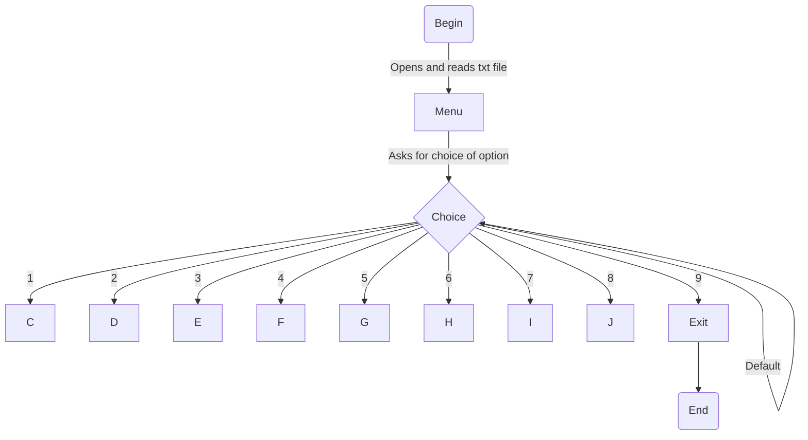

```mermaid
graph TD;
a(Begin)--> |Opens and reads txt file|A;
A[Menu]-->|Asks for choice of option|B{Choice};
B --> |1|C;
B --> |2|D;
B --> |3|E;
B --> |4|F;
B --> |5|G;
B --> |6|H;
B --> |7|I;
B --> |8|J;
B --> |9|K[Exit] --> Z(End);
B --> |Default|B;
```